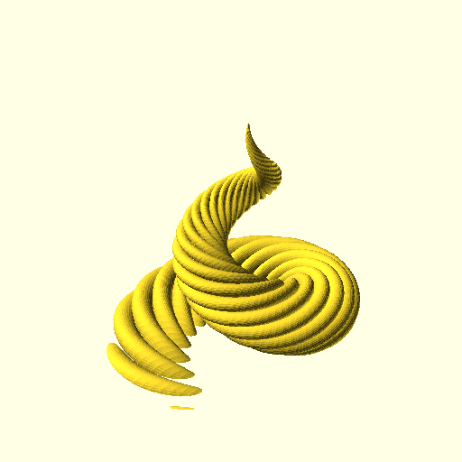

# Parametric horns
Based on horn3.py by Tom P. (user [tpchuckles](https://www.thingiverse.com/tpchuckles/designs) on [Thingiverse](https://thingiverse.com)

The original code can be found [at the files tab of his thing](https://www.thingiverse.com/thing:5392374/files).

Modified by Mitch Patenaude Contact mitch@mitchpatenaude.net user [pneumaticdeath](https://www.thingiverse.com/pneumaticdeath/designs) on [Thingiverse](https://thingiverse.com).

The script takes several arguments to allow you to tweak the look of the horns:
```
usage: make_horn.py [-h] [-d SPIRAL_DIAMETER] [-D CONE_DIAMETER] [-H HEIGHT] [-r RIBS] [-R ROTATIONS] [-N LAYERS] [-n SPIRALS] [-t TWISTS]
                    [--output OUTPUT]

optional arguments:
  -h, --help            show this help message and exit
  -d SPIRAL_DIAMETER, --spiral-diameter SPIRAL_DIAMETER
                        base diameter of the spiral going up the suface of the cone (default 25)
  -D CONE_DIAMETER, --cone-diameter CONE_DIAMETER
                        base diameter of the cone (default 35)
  -H HEIGHT, --height HEIGHT
                        height of the cone (default 100)
  -r RIBS, --ribs RIBS  number of ribs per rotation (default 10)
  -R ROTATIONS, --rotations ROTATIONS
                        rotations around the cone (default 2)
  -N LAYERS, --layers LAYERS
                        (default 200)
  -n SPIRALS, --spirals SPIRALS
                        (default 20)
  -t TWISTS, --twists TWISTS
                        (default 3)
  --output OUTPUT
```

Here are some examples of different parameters:

```make_horn.py```


```make_horn.py --height 50```


```make_horn.py --height 150```


```make_horn.py --spiral-diameter 15```

