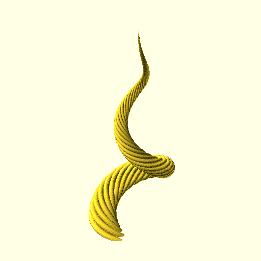

# Examples of different parameters

## Ribs:
### 10 ribs (default)
```make_horn.py```


### 8 ribs (somewhat more coarse)
```make_horn.py --ribs 8```


### 20 ribs
```make_horn.py --ribs 20```


##  Height
### 100mm (default)
```make_horn.py```


### 50mm
```make_horn.py --height 50```


### 150mm
```make_horn.py --height 150```


## Spiral diameter
### 5mm 
```make_horn.py --spiral-diameter 5```


### 15mm
```make_horn.py --spiral-diameter 15```


## Twists
### 5 twists
```make_horn.py --twists 5```


### 7 twiests
```make_horn.py --twists 7```


## Making a gazelle horn
```make_horn.py --spiral_diameter 5 --cone-diameter 15 --height 150```

